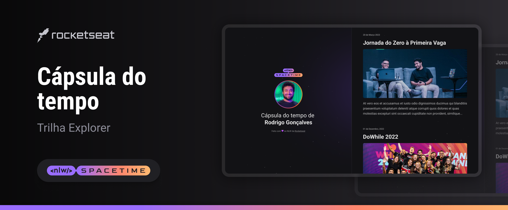

 
  

## 🖥️ Projeto
Esse é o projeto Web Responsivo de uma cápsula do tempo para exibir memórias em uma linha do tempo.

## 🚀 Tecnologia
Esse projeto foi desenvolvido durante o NLW da Rocketseat com as seguintes tecnologias:

-HTML
-CSS
-Git e Github

## 🏷️ Layout
Você pode vizualizar o layout do projeto através 
[desse link](https://www.figma.com/file/EDPL3RukTdOZKLqVu6ITid/C%C3%A1psula-do-tempo-%E2%80%A2-Trilha-Explorer-(Community)-(Copy)?type=design&node-id=306%3A3&t=D3EspYaULNtxYEaC-1).
É necessário ter uma conta no [Figma](https://www.figma.com)
